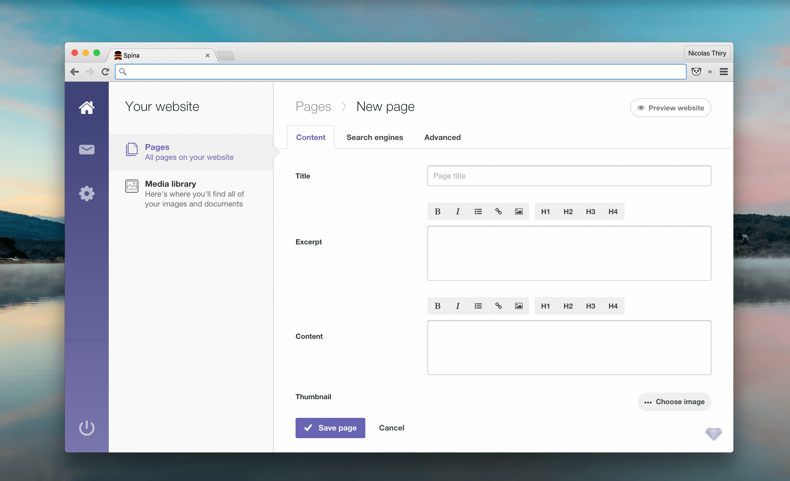
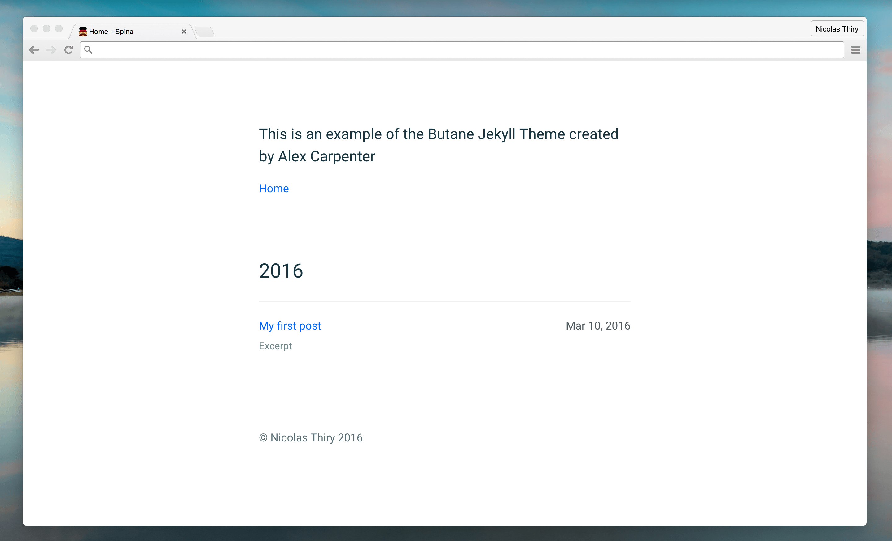

<div class="alert alert-warning">
Spina has been updated a lot since I've written these articles. The code and commands given here may be outdated.
</div>

Hi, lately I have been working on a different project that no longer requires React — neither Javascript actually. It's a CMS built on Ruby on Rails, a kind of equivalent to Wordpress, called [Spina](http://www.spinacms.com/). It's new, it's open-source, it's ruby on rails and it's awesome !

The down-side of this project is that they don't really have any documentation yet. That's why I've decided to start writing about it and even contributed to their Wiki. As I am a front-end developer, I won't be able to talk about all the back-end ruby part. It's going to be mainly some front-end tips and instructions to get started with Spina. You won't find a lot of articles or tutorials about this, but the developers at Spina are very reactive and even opened a Slack channel to communicate with it's users !

So let's get started !

## Installing Spina

Installing Spina is really easy, you only need 3 simple lines given in their [Github repo](https://github.com/denkGroot/Spina).
As it's a Ruby on Rails CMS, you obviously need to have a Rails app first.

If you do have Ruby on Rails working, simply create a new project.

```Shell
rails new MySpinaApp
```

Then add these lines to your `Gemfile`

```Ruby
gem 'spina-template'
gem 'spina'
```

Don't forget to `bundle install` !

And finally run the installation with the following command in your terminal and answer to the different questions that the command line asks you.

```Shell
rails g spina:install
```

Now if you run `rails s` and open up `localhost:3000` you should have your CMS running. If you want to go to the admin panel, just go to `localhost:3000/admin` and use the login you gave in the command line to log in !

## Creating a Spina Theme

After installing Spina, and if you chose to use the Demo theme, you will have two files in `config/initializers/themes`, a `default.rb` and a `demo.rb`. I recommend deleting these later, since it might through you an error since your pages are using one of these at the moment.

This is how our New page panel will look like for our Post page creation.



You can go and create a new file in this folder with your own theme name, I'll be calling it `labs.rb`.

Then add the following by changing "Labs" by your theme name !

```Ruby
module Spina
  module LabsTheme
    include ::ActiveSupport::Configurable

    config_accessor :title, :page_parts, :view_templates, :layout_parts, :custom_pages, :plugins, :structures

    self.title = 'Labs'

  end
end

theme = Spina::Theme.new
theme.name = 'Labs'
theme.config = Spina::LabsTheme.config
Spina.register_theme(theme)
```

Ok so we now have our theme configured. However we need to add page_parts, templates and a custom page.
The following code snippets will go right after `self.title = 'Labs'`.

Let's add some page_parts. If you look at the demo theme you can see 8 page_parts that are all the available page_parts on Spina (Line, Text, Photo, Photo collection, Attachment, Attachment collection, Structure and Color). In our case we are building a simple blog, therefore we only need 3 parts: an **excerpt** (Text), a **content** (Text) and a **thumbnail** (Photo).

```Ruby
self.page_parts = [
  # Labs Page parts
  { name: 'excerpt', title: 'Excerpt', page_partable_type: 'Spina::Text' },
  { name: 'content', title: 'Content', page_partable_type: 'Spina::Text' },
  { name: 'thumbnail', title: 'Thumbnail', page_partable_type: 'Spina::Photo' }
]
```

For our blog we will need 3 type of pages: a Homepage with the list of all our posts, a Post page and a Custom page for all the other static pages (i.e. an About page).

```Ruby
self.view_templates = {
  'homepage' => { title:'Homepage', page_parts: %w(excerpt content) },
  'show' => {
    title: 'Default Post', description: 'A default post page', usage: 'Can be used for a blog post',
    page_parts: %w(excerpt content thumbnail)
  },
  'page' => { title:'Custom Page', page_parts: %w(content) }
}
```
Writting `%w(excerpt thumbnail content)` is the same as writting `["excerpt", "thumbnail", "content"]`. It's just a shortcut.

And finally we will add a custom_pages, that will be our Homepage. It seems to be a bug with Spina, but every time you update your Preferences, it regenerates all the defined custom_pages if they don't exist. And unfortunately I didn't manage to not to define any custom_pages. That's why we will only define the Homepage which will always be existent on our website.

```Ruby
self.custom_pages = [
  { name: 'homepage', title: 'Home', deletable: true, view_template: 'homepage' }
]
```

I'd rather set `deletable: true`, in case there is a bug and we get two or more homepages...

## Creating the Spina Views

We are going to create a blog similar to the one that I currently have. It's done with the [Butane theme for Jekyll](https://github.com/alexcarpenter/butane-jekyll-theme) created by [Alex Carpenter](http://alexcarpenter.me/) with some adjustments that I have done (adding excerpts and covers).

This is what you should get at the end.



To achieve this you will need to create the following files:

* app/views/layouts/lemonsky/application.html.haml
* app/views/labs
  * /pages/homepage.html.haml
  * /pages/show.html.haml
  * /pages/custom.html.haml
  * /shared/_footer.html.haml
  * /shared/_navigation.html.haml

Now that the views exist, you can actually go and create your pages in your Admin Panel and get your app to work. However your pages won't show anything. Here I am just going to show you specific examples to show you how things work on Spina, for the rest I will invite you to download the sources attached to this article.

### Listing the articles with ancestry

Everything you need to display is contained in the `@page` variable. Also Spina is based on ancestry to handle your pages tree. You can use it like this:

_homepage.html.haml_

```Haml
%section.c-archives
  %ul.c-archives__list
    - @page.children.each do |child|
      - if child == @page.children.first
        - this_year = child.created_at.strftime("%Y")
        %h2.c-archives__year= this_year
      - else
        - next_year = child.created_at.strftime("%Y")
        - if this_year != next_year
          %h2.c-archives__year= next_year
      %li.c-archives__item
        %h3= link_to child.title, child.materialized_path
        %p= child.created_at.strftime("%b %-d, %Y")
        .n-post-excerpt= child.content(:excerpt).try(:html_safe)
```

[Here is the list of all the methods you can use to navigate your tree.](https://github.com/stefankroes/ancestry#navigating-your-tree)

To get the full code for this theme you can go and [download the sources here](https://github.com/nicolasthy/Spina-Butane-Theme)!

### Bonus: Creating a breadcrumb

Here is another example of how you can manipulate your tree using ancestry in Spina

```Haml
%ol.breadcrumb
  %li
    = link_to "Home", root_url
  - @page.ancestors.each do |ancestor|
    %li
      = link_to ancestor.menu_title, ancestor.materialized_path
  %li.active
    %a = @page.menu_title
```

`menu_title` is your Navigation Title in your Advanced tab and the `materialized_path` is in the Search Engine tab when creating / updating a page. The name of these variables can be found when looking into the [source code of Spina](https://github.com/denkGroot/Spina/blob/master/app/views/spina/admin/pages/_form_advanced.html.haml).
