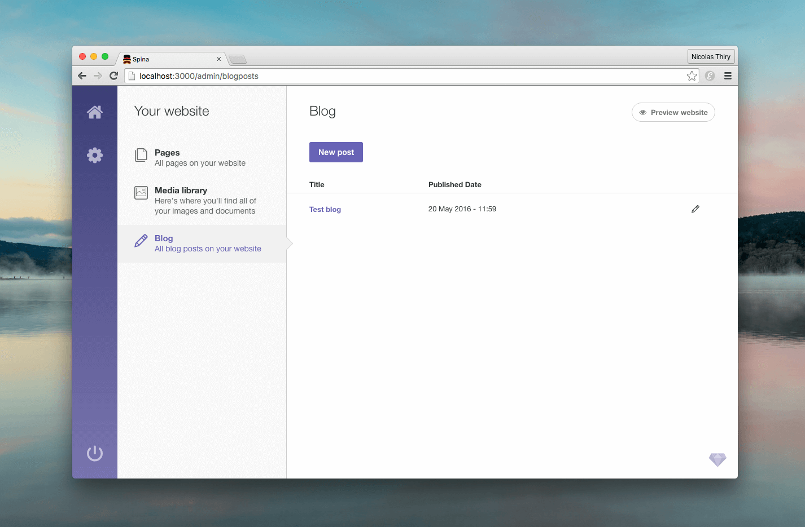

<div class="alert alert-warning">
Spina has been updated a lot since I've written these articles. The code and commands given here may be outdated.
</div>

Hi, I've been very busy lately trying to explore new stuff and I realized it was time to share some of my discoveries. Some of you may want me to write more articles about React but to be honest I've been mainly working on Spina and there is so much to do on it, really enjoying everything about it !

Therefore I'll be starting a project with you guys: Building a blog ! This will allow me to see if the final result could be a viable solution for my own blog. I'll be learning everything on the go, so as soon as I've managed to achieve something I'll share it with you.

In this article we will take a look at [Bram Jetten's Spina Blog Plugin](https://github.com/Bramjetten/Spina-Blog-Example). I also assume that you have read my previous articles about Spina or at least have a working project with Spina, you can [follow these steps to be up to date]({{site.baseurl}}/spina-rails-cms/) !

<div class="alert alert-warning">
Please check your Spina gem version, it needs to be <b>0.9.0</b> or higher to be able to install the blog plugin !
</div>

So let's get started !!

## Installing a plugin

Unfortunately Bram's blog plugin example does not have any installation guide yet. However Harm de Wit did publish a [wiki to create your own plugin](https://github.com/denkGroot/Spina/wiki/How-to-create-a-plugin) which helped understand how the installation worked.

First of all you need to retrieve the files in the right location (Here I am using a fork of Bram's plugin which is originaly in dutch):

```Shell
# run these commands in your rails project
cd vendor
mkdir plugins
cd plugins
git clone https://github.com/nicolasthy/Spina-Blog-Example.git spina_blog
```

Once you've cloned the file you can add the plugin to your Gemfile and run `bundle install`:

```Ruby
gem 'spina_blog', path: 'vendor/plugins'
```

This plugin comes with migrations that you need to retrieve in your main app with the following commands:

```Ruby
rake spina_blog_engine:install:migrations
rake db:migrate
```

You have now succesfully installed the blog plugin ! Now if you head to your admin panel you should have a new tab for Blog Posts !



## Setting up the views

I'm going to build something different than my current blog to be able to completely use the plugin's functionalities. Therefore I'll be using the `/blog` path to display all the blogposts and the `/` path to display a simple landing page.

First of all let's create the correct views by overriding the plugin. We need two new files:

  * `/app/views/blogposts/index.html.haml`
  * `/app/views/blogposts/show.html.haml`

The controllers already exist and return the correct data, we just have to retrieve them in the new views:

`index.html.haml`

```Haml
%ul
  - @blogposts.all.each do |blog|
    %li= link_to blog.title, blog.materialized_path
```


`show.html.haml`

```Haml
%h1= @blogpost.title
= @blogpost.content.try(:html_safe)
```

Unfortunately if you try to access these pages on the `/blog` path, it would not be working.
The fix is to add a `custom_page` in your theme for your Blog to be able to add it in the menu and for it to get your theme application layout.

```Ruby
theme.custom_pages = [{
  name:           'homepage',
  title:          'Homepage',
  deletable:      false,
  view_template:  'homepage'
},
{
  name: 'blog',
  title: 'Blog',
  deletable: false,
  view_template: 'homepage'
}]
```

Now try accessing your http://localhost:3000/ . You should now see a new item in your Navigation: "Blog". Awesome your blog is up and running !!

The last step is to style your new app. Sadly I won't do a step by step for this part, you're on your own ! :)
However let me know if you would be interested by having a styling tutorial for your Spina Blog app on Twitter ([@nicolasthy](http://twitter.com/home?status=@nicolasthy)).